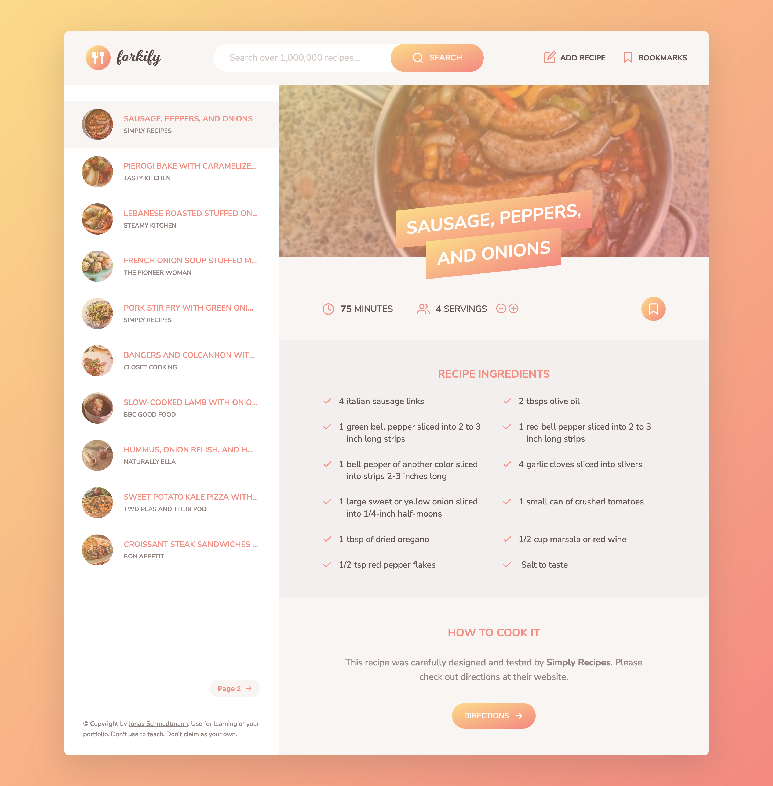

# JavaScript Recipe Search Project

This is a project from my JavaScript course, where I built a Recipe Search Application using JavaScript, APIs, and various modern development techniques.

## Table of contents

- [Overview](#overview)
  - [Screenshot](#screenshot)
  - [Links](#links)
- [My process](#my-process)
  - [Built with](#built-with)
  - [What I learned](#what-i-learned)
  - [Continued development](#continued-development)
- [Author](#author)
- [Acknowledgments](#acknowledgments)

## Overview

### Screenshot

### Links

- Solution URL: [https://github.com/Jair-MV/forkify](https://github.com/Jair-MV/forkify)
- Live Site URL: [https://forkify-jmv.netlify.app/](https://forkify-jmv.netlify.app/)

## My process

### Built with

- JavaScript ES6+
- MVC architecture
- OOP (Object-Oriented Programming)

### What I learned

This project was a significant milestone for me, as it was my first major application utilizing JavaScript. I applied the MVC (Model-View-Controller) architecture, which helped me organize and structure my code more efficiently. I also delved deeper into Object-Oriented Programming (OOP), creating modular and reusable code. Some of the main things I learned include:

- How to implement and structure an MVC architecture.
- Making API calls and handling responses.
- Managing application state using JavaScript.
- Creating bookmark and pagination functionalities for a better user experience.

### Continued development

Moving forward, I want to enhance my understanding of advanced JavaScript, especially in terms of working with APIs and asynchronous operations. Additionally, I plan to refine my skills in OOP and explore other architectural patterns to see what fits best for different projects.

## Author

- GitHub - [JairMV](https://github.com/Jair-MV)

## Acknowledgments

Thanks to my course instructor for guiding me through this project.
